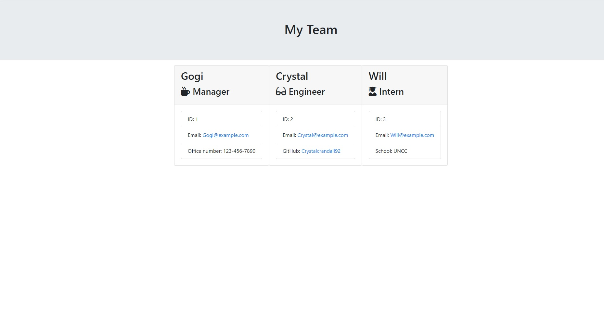

# OOP - Employee Template Engine

## Table of Contents
1. [Description](#description)
2. [Installation](#installation-instructions)
3. [Usage](#usage-information)
4. [Contribution](#contribution-guidelines)
5. [Test](#test-instructions)
6. [Questions and Contact](#questions-and-contact)
### Description
This app is designed to take the user's input for a manager, engineer, and intern team and display them using certain categories for each one.

All Users: Name, ID, Email, and role in the team
Manager: Office Number
Engineer: Github username
Intern: Current school
### Installation Instructions
Download all files and properly install through npm. 
### Usage Information
Use "node app" to start the questions for the template.
### Contribution Guidelines
See contact information
### Test Instructions
Run "node app"
### Questions and Contact
#### Github Username: crystalcrandall92
#### Github Link: https://github.com/crystalcrandall92
#### Email: crystalcrandall92@yahoo.com

